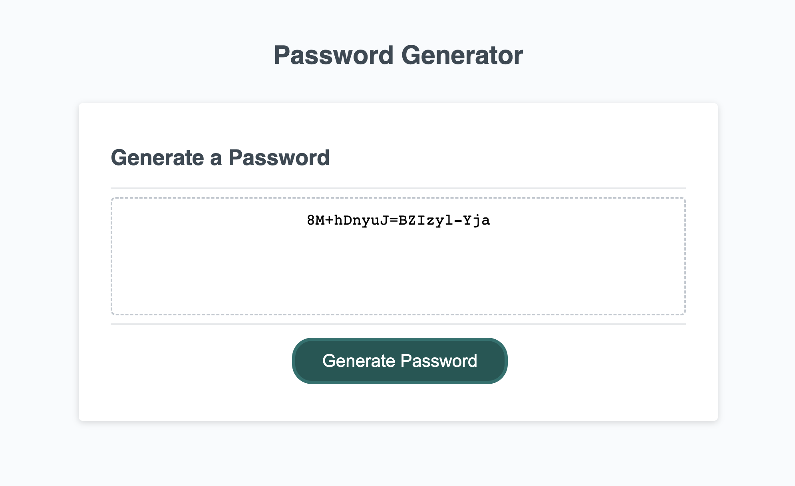

# Random Password Generator 

## This generator was a project assigned during coding bootcamp, and meets the following crieteria: 
* The option to include special characters, numbers, lowercase letters, and/or uppercase letters
* a length between 8 and 128 characters 
* a final password that follows the input as directed by the user

## I also added some features that were not directly required, but enhance the final product:
* adjusted the css to create a nicer looking button
* created error messages for situations where users may need instruction
* added console logs for recorded user input for myself or future developers to make edits more easily

Link to GitHub pages: 

[Click here!](https://lrltillman.github.io/password-generator)

Screenshot of browser:

### Received assistance from tutor Ramon Sanchez